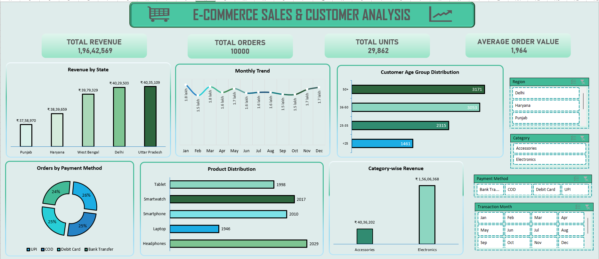

  

# E-Commerce Sales & Customer Analysis 
Excel | Data Analysis | Business Insights | Visualization

This project analyzes sales performance, customer behavior, and product trends for an e-commerce business using Excel. The goal is to uncover actionable insights and present them through an interactive, user-friendly dashboard supported by a professional PPT.

### 🔍 Project Overview
This project explores key business questions such as:
- Which states generate the highest revenue?  
- Which age groups contribute the most to sales?  
- What products are most popular?  
- How does monthly performance vary?  
- What are the preferred payment methods?  
An interactive Excel dashboard was built using Pivot Tables, Pivot Charts, Slicers, and KPIs to help stakeholders understand performance at a glance.

### 📊 Dashboard Features
### 1️⃣ Sales & Revenue Analysis
State-wise revenue comparison
Category-wise revenue split
Monthly performance trend

### 2️⃣ Customer Insights
Age-group distribution
Buying behaviour patterns

### 3️⃣ Product Performance
Demand distribution across categories
Top vs. low-performing items

### 4️⃣ Payment Method Breakdown
Mode-of-payment usage (UPI, COD, Cards, Bank Transfer)

### 🧠 Key Insights
Delhi & Uttar Pradesh are the top revenue contributors.
The electronics category dominates with ₹1.56 crore revenue.
The majority of customers are aged 36–50 and 50+.
Sales remain consistent throughout the year with small peaks.
Payment methods are evenly used, with a slight preference for UPI. 

### 💡 Business Recommendations
Strengthen marketing & delivery in Punjab and Haryana.
Target 36+ age groups to maximise conversions.
Prioritise electronics promotions, the highest revenue segment.
Boost visibility of low-demand categories like laptops & tablets.
Maintain multiple payment options due to evenly distributed usage.

### 🛠 Tools & Techniques Used
Microsoft Excel
Pivot Tables
Pivot Charts
Slicers
Conditional Formatting
Dashboard Design
PowerPoint for presentation
Data Cleaning & Preprocessing
Trend, Category, and Customer Analytics
Use slicers to interact with the dashboard
Explore KPIs and visuals for insights 

### 📝 Conclusion
This project provides a complete overview of the sales ecosystem — customers, states, products, categories, and trends — packaged into an interactive Excel dashboard. It enables faster, data-driven decisions and highlights areas for strategic improvement.

### 🌐 Author
Tuhina Ghosh — Data Analyst
If you liked this project, feel free to ⭐ star the repository! 
